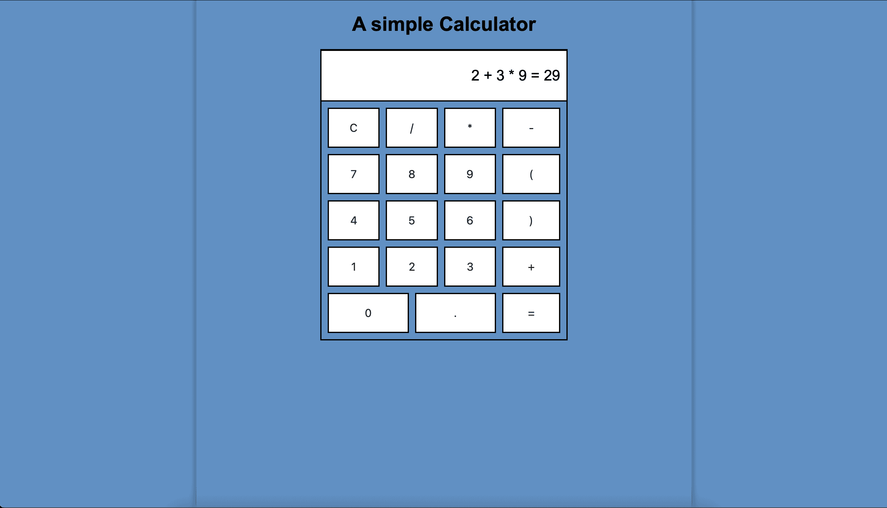
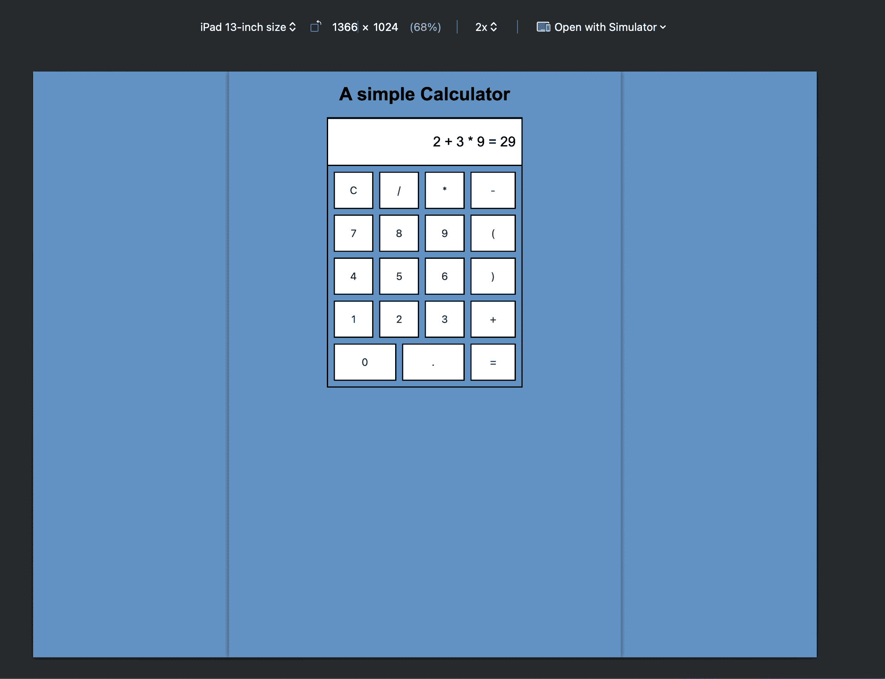
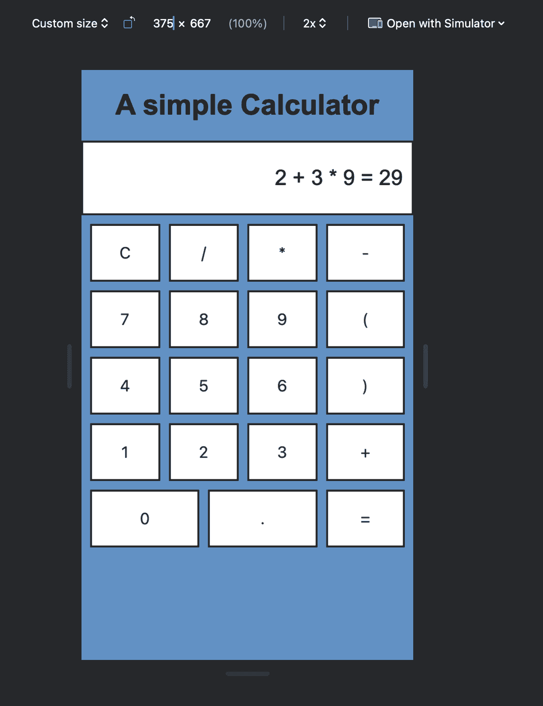

# Calculator App
This simple calculator app allows users to perform basic arithmetic operations like addition, subtraction, multiplication, and division using HTML, CSS, and JavaScript.





The application UI  display screen shows the current input and result, buttons for digits 0 to 9, addition, subtraction, multiplication, and division buttons, and computation and reset buttons.

## Usage
- Clone the repository with the command on your terminal
  ```bash
  git clone https://github.com/Fawazabdganiyu/calculator-app.git
  ```

  Or download the zip file from `https://github.com/Fawazabdganiyu/calculator-app/archive/refs/heads/main.zip`

- Navigate to the calculator-app directory. If downloaded, unzip the file

- Then open the `index.html` file on your browser and compute your calculations.
